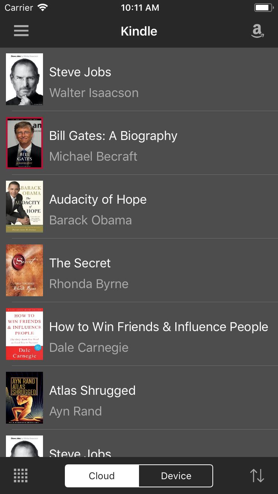
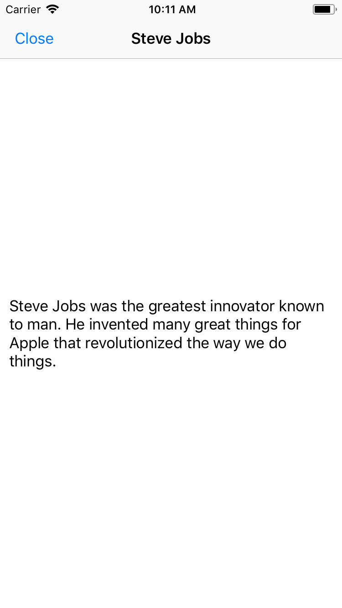

#The goal of this tutorial was to build an Amazon Kindle App clone. In the tutorial series, I learned how to apply autolayout programmatically and build UI elements from scratch without the storyboard. These video tutorials were very clear and straigthforward, and Brian Voong claried the reasons why building your projects in code gives you a better learning experience of how UIKIT works.

  

    

          
    

    

         
    

  

